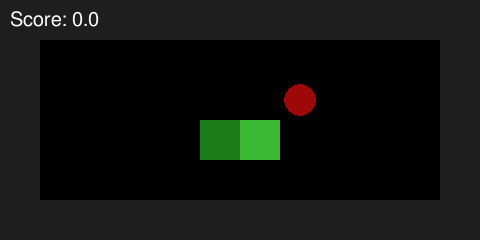
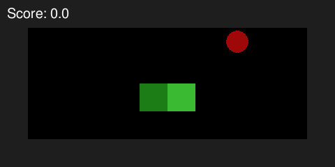
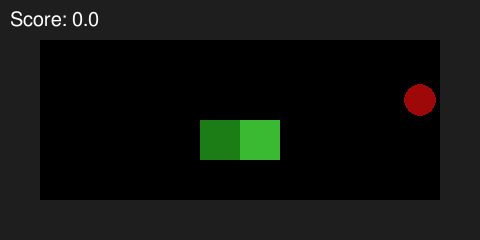
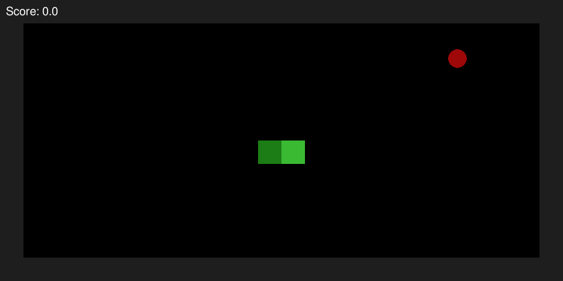

# ReinforcedSnake (Projekt_masekda4)

Reinforcement learning algorithms demonstrated on classic Snake.





The above visualizations are random episodes from trained MonteCarlo, Q-Learning and SARSA agents (in this order).

# Installation

The package is not registered and can be installed in the following way

```
(env) pkg> add https://github.com/B0B36JUL-FinalProjects-2022/Projekt_masekda4
```

# Usage

The goal of this package is to enable training of reinforcement learning agents and demonstrate their performance on the video game Snake.


There are two main entities - agent and environment.

Available environments:
- `SnakeGame` - Snake videogame
- `BanditsEnv` - simple environemnt for testing

Available agents:
- `MonteCarloAgent` - Monte Carlo
- `QLearningAgent` - Q-Learning (1-step Expected SARSA)
- `SarsaAgent` - 1-step SARSA

```julia
using ReinforcedSnake
# create any environment
env = SnakeGame(6, 12)
# create any agent
agent = MonteCarloAgent(env.STATE_SPACE, env.ACTION_SPACE)
# train the agent
train!(env, agent, episodes=100_000, max_steps=100, epsilon=0.5, epsilon_final=0.01, print_each=1_000)
# get results using greedy behavior
evaluate_on_episode!(env, agent, max_steps=1000)
```

More examples are included in the `examples` folder.

## Visualization

The `SnakeGame` environment supports pretty display in terminal. Full episode can be simulated using `print_game!`. 

```
############
#          #
#      F   #
#    @H    #
#          #
############
```

Another possibility is to export the game using `export_game!` and render it using the included Python utility script `render.py`. See `examples/rendering.ipynb` for details.

